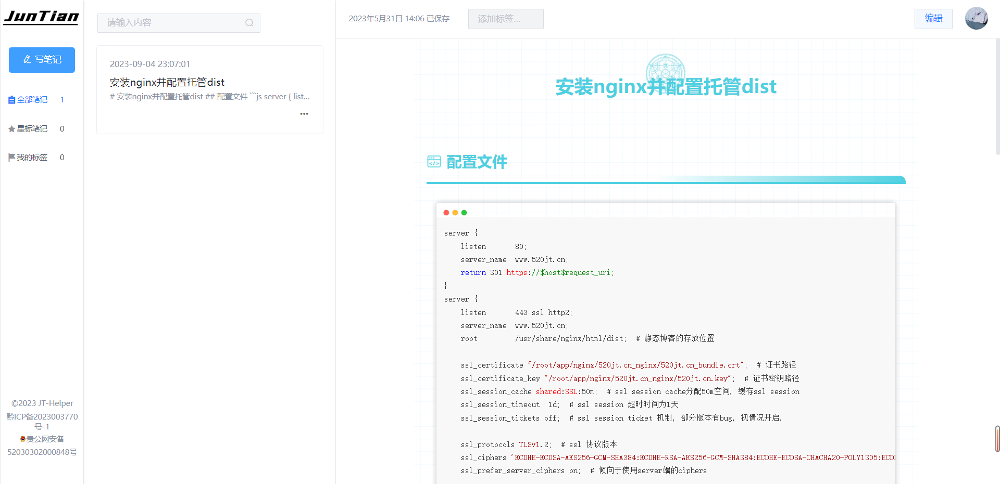

# JT-Helper

> 一个Markdown格式的笔记在线编辑工具




## 功能

- 新建一个md笔记
- 查看所有笔记
- 给笔记添加标签
- 通过标签查看笔记
- 给笔记添加星标
- 在线查看
- 编辑笔记
- 登录
- 退出

## 待办

- 向下滚动刷新笔记

## 部署

- ### API 服务（必需）

  本程序依赖 [jt-helper-api]() 运行，请确保您已成功部署该项目

- 配置跨域

  在根目录的vue.config.js文件中配置了反向代理,你可以根据自己的需要配置

  ```js
   devServer: {
      proxy: {
        '/api/': {
          target: 'http://127.0.0.1:520/',
          pathRewrite: { '^/api/': '' },
          changeOrigin: true, //开启代理
          ['/api/']: ''
        },
      },
    },
  ```

- **安装** [node.js](https://nodejs.org/zh-cn/) **环境**

  > node > v18.16.0
  > npm > 9.5.1

- 然后以 **管理员权限** 运行 `cmd` 终端，并 `cd` 到 项目根目录

- 在 `终端` 中输入：

  ```
  # 安装依赖
  npm install
  
  # 预览
  npm run start
  
  # 构建
  npm run build
  ```

> 构建完成后，静态资源会在 **`dist` 目录** 中生成，可将 **`dist` 文件夹下的文件**上传至服务器，也可使用 `Vercel` 等托管平台一键导入并自动部署

## 技术栈

- Vue
- Vue-cli
- bytemd